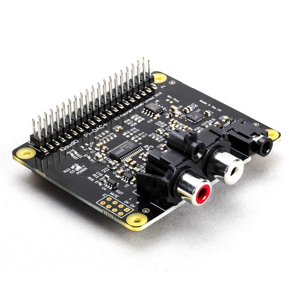
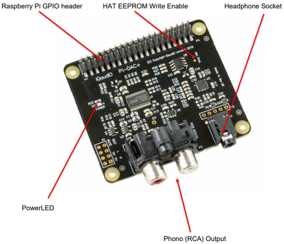
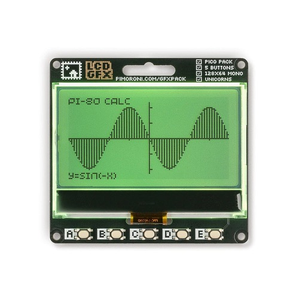
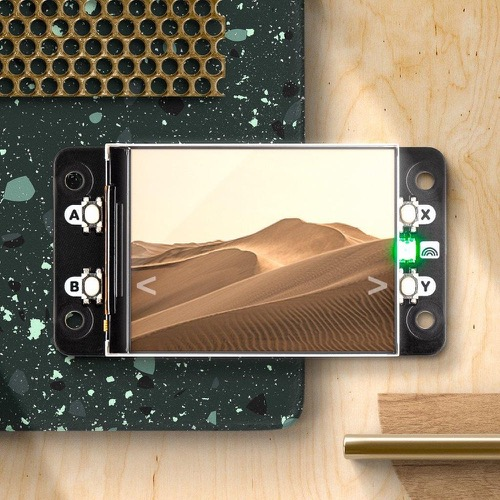
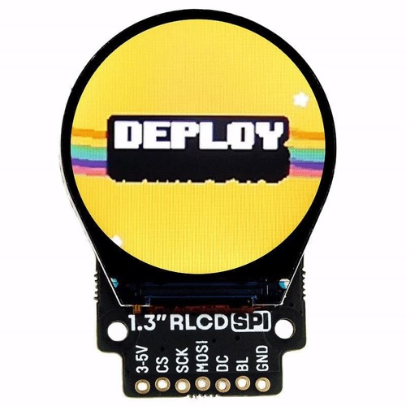
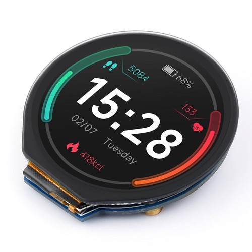
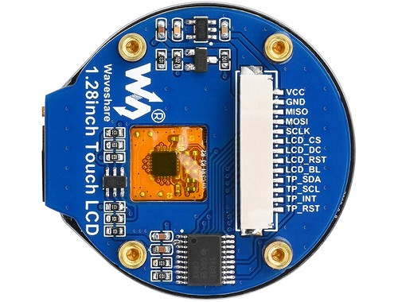
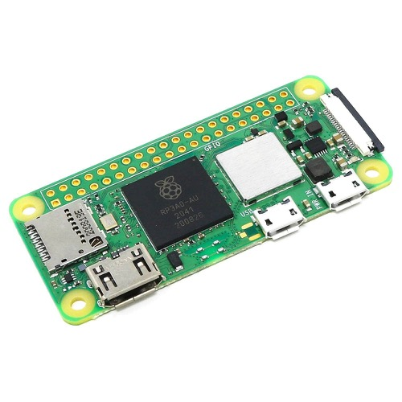
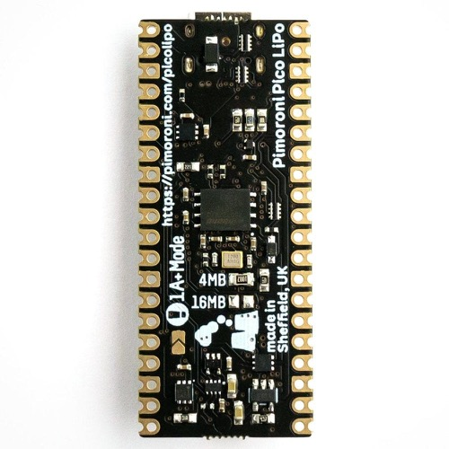

> [!INFO] Also see
> [[Micropython]], [[Watch Project]]
# Audio and Video
## IQaudIO DAC+ (Pi & Zero)

### Description

The DAC+ is IQaudIO's lowest-cost audio output HAT for the Raspberry Pi (any 40-pin model), supporting 24‑bit 192kHz high-resolution digital audio.

It uses a Texas Instruments PCM5122 DAC to deliver stereo analogue audio to a pair of phono connectors, and also provides a dedicated headphone amplifier.

The DAC+ is compatible with any 40-pin Raspberry Pi and requires no soldering.

Those looking for the best possible audio quality should consider the [IQaudIO DAC Pro](https://thepihut.com/products/iqaudio-dac-pro) which uses a Texas Instruments PCM5242 DAC for even higher signal-to-noise ratio.
### Features

-   Standard 40-pin header (compatible with any 40-pin Raspberry Pi)
-   PCM5122 DAC
-   24-bit depth 192kHz (Full HD) audio
-   Dedicated headphone amplifier
-   Phono RCA output
-   Powered by the Raspberry Pi PSU
-   Onboard EEPROM for auto-configuration
-   Power LED
-   No soldering required
-   Standoffs included
-   Compatible with Volumio, Rune, Max2Play, MoodeAudio

-   P1: Analogue out (0..2VRMS), carries GPIO27, MUTE signal (headphone detect), Left and Right Audio and Left and Right Ground.
-   P6: Headphone socket signals (pin1: LEFT, 2:GROUND, 3: RIGHT, 4:GROUND, 5:DETECT)
### Files

-   [Product Guide](./files/iq_audio_product_guide.pdf)

# Screens
## Pico GFX Pack (Pico)

This fun 1-bit illuminated display plugs into the back of a Raspberry Pi Pico (or Pico W) and gives you a tasty 128x64 grid of individually controllable pixels to play with, plus an uber-bright RGBW LED backlight that you can set to any colour. The extra white LED element improves contrast and means the backlight can display nicer whites and delicious pastels.

It also features five useful buttons for inputs and a Qw/ST (Qwiic/STEMMA QT) connector to make it easy to connect it up to sensors and other breakouts.

Your Pico will need to have pin headers soldered to it (with the pins pointing downwards) to attach to our add-on boards.

NOTE: This does NOT come with a Raspberry Pi or W
### Features

-   128x64 pixel, 2.15" mono LCD display
-   Integrated diffuser/reflector assembly
-   Single-zone RGBW LED backlight
-   Five user buttons
-   Reset button
-   Pre-soldered socket headers for attaching to Pico
-   Qw/ST (Qwiic/STEMMA QT) connector for attaching breakouts
-   Compatible with Raspberry Pi Pico/Pico W.
-   Comes fully assembled
-   No soldering required (as long as your Pico has header pins attached).
-   [C/C++ and MicroPython libraries](https://github.com/pimoroni/pimoroni-pico)
-   [Schematic](https://cdn.shopify.com/s/files/1/0174/1800/files/GFX_pack_schematic.pdf?v=1668443908) (Also [local copy](./files/GFX_pack_schematic.pdf))
### Resources

-   [Download pirate-brand MicroPython](https://github.com/pimoroni/pimoroni-pico/releases)
-   [Examples](https://github.com/pimoroni/pimoroni-pico/tree/main/micropython/examples/gfx_pack)
-   [Pico GFX Pack function reference](https://github.com/pimoroni/pimoroni-pico/blob/main/micropython/modules_py/gfx_pack.md)
-   [PicoGraphics function reference](https://github.com/pimoroni/pimoroni-pico/tree/main/micropython/modules/picographics)
### Connecting Breakouts

The Qw/ST connector on Pico GFX Pack makes it super easy to connect up [Qwiic or STEMMA QT breakouts](https://thepihut.com/search?q=qwiic%2Fstemma+breakout&narrow_by=&sort_by=relevency&page=1). If your breakout has a QW/ST connector on board, you can plug it straight in with a JST-SH to JST-SH cable.

Breakout Garden breakouts that don't have a Qw/ST connector can be connected using a JST-SH to JST-SH cable plus a Qw/ST to Breakout Garden adaptor. Want to use >2 breakouts at the same time? Try [this adaptor](https://thepihut.com/products/sparkfun-qwiic-multiport)!

-   [List of breakouts](https://github.com/pimoroni/pimoroni-pico) currently compatible with our C++/MicroPython build.
## Display HAT Mini (Pi & Zero)

Display HAT Mini features a bright 18-bit capable 320x240 pixel display with vibrant colours and formidable IPS viewing angles, connected via SPI. It's got four tactile buttons for interacting with your Pi with your digits and an RGB LED for notifications. We've also squeezed in a QwST connector (Qwiic / STEMMA QT) and a Breakout Garden header so it's a doddle to connect up different kinds of breakouts.

It will work with any model of Pi with a 40 pin header, but we think it goes with the Raspberry Pi Zero particularly well - we've included a pair of standoffs so you can use to bolt HAT and Pi together to make a sturdy little unit. To accommodate the screen Display HAT Mini is a bit bigger than a standard mini HAT or pHAT - it's around 5mm taller than a Pi Zero (so a Mini HAT XL or a Mini HAT Pro, if you will).
### Resources

-   [Pinout](https://pinout.xyz/pinout/display_hat_mini#)
-   [Schematic](./files/dhat_mini_schematic.pdf)
-   [ST7789 Python library](https://github.com/pimoroni/st7789-python)
### Software

We've added support for this screen to our [ST7789 Python library](https://github.com/pimoroni/st7789-python) so it's easy to write and draw on using libraries like PIL - there are examples showing how you can display shapes, text and gifs.

We've also been having fun with [fbcp-ili9341](https://github.com/juj/fbcp-ili9341/pull/242) - a high-level framebuffer driver for SPI-based LCD displays. The Raspberry Pi OS desktop is a [leeetle small](https://twitter.com/Gadgetoid/status/1453045016083976195) on a 2.0" screen, but this might be a good option if you're doing something like building your own custom retro console.
### Attaching Breakouts

You can connect breakouts and modules with a Qwiic or STEMMA QT connector into Display HAT Mini with one of handy cables.

If you have a [Breakout Garden breakout](https://thepihut.com/collections/pimoroni-breakouts) without a Qw/ST connector, you can either pop one of these adaptors on the end of your cable, or you can plug a [Breakout Extender](https://thepihut.com/products/i2c-breakout-extender-pack-of-3) into the header at the other end of Display HAT Mini (you can find it next to your Pi's SD card slot).

-   The buttons are close to the edge of the screen, so it's worth taking a bit of care when pressing the buttons that you're not also pressing down on the screen, particularly at the edge with the ribbon cable.
-   Please note that because of Display HAT Mini's extra size, it will overhang adjacent slots on expansion boards like pHAT Stack, Black HAT Hacker, HAT Hacker HAT and Flat HAT Hacker. No shame - every HAT is valid, every HAT is beautiful.
-   We've found two standoffs to be sufficient to keep this HAT firmly in place, but if you want to add standoffs at every corner of your Zero so you can use it to stop a tank or something you can pick up standoffs here (10mm might be best)
## 1.3" SPI Colour Round LCD (Any)

Like our [smaller 0.9"](https://thepihut.com/products/0-96-spi-colour-lcd-160x80-breakout) and our [squarer 1.3"](https://thepihut.com/products/1-3-spi-colour-lcd-240x240-breakout) LCD breakouts, it's an IPS display so it has great viewing angles and it's super-crisp and bright. It's driven by SPI and you should be able to run it at up to ~60FPS, although we've found that anywhere from 10FPS looks good for most uses.

You can use this breakout completely solder-free with our [Breakout Garden HAT with SPI](https://thepihut.com/products/breakout-garden-for-raspberry-pi-i2c-spi), [Breakout Garden Mini with SPI](https://thepihut.com/products/breakout-garden-mini-i2c-spi) or [Breakout Garden 400](https://thepihut.com/products/breakout-garden-for-raspberry-pi-400).

Check out our full range of Breakout's and Breakout Garden's [here](https://thepihut.com/collections/pimoroni-breakouts).
### Software

This breakout uses the [same ST7789 library](https://github.com/pimoroni/st7789-python) as the square version. The library makes it straightforward to display images, text or graphics, and even display animated GIFs! If you're using a

    sudo pip3 install st7789
    You may also need to enable I2C and SPI in raspi-config.

When running the generic examples, you'll need to specify that you're using a round display to offset the screen correctly, e.g.

    python3 gif.py deployrainbows.gif round
### Connecting to a Raspberry Pi

If you're not using a Breakout Garden, then this is how to connect your LCD Breakout up to your Raspberry Pi.

Our Python library is set up to use SPI 0 by default on the Pi (BCM 7 for CS, BCM 11 for SCK, and BCM 10 for MOSI), BCM 9 for DC, and BCM 19 for the backlight.

Here's which pins to connect between your LCD breakout and your Pi's GPIO (note that it's BCM pin numbering):

-   3-5V to any 5V or 3V pin
-   CS to BCM 7
-   SCK to BCM 11
-   MOSI to BCM 10
-   DC to BCM 9
-   BL to BCM 19
-   GND to any ground pin

You can of course use other pins with your LCD Breakout, but you'll have to change them accordingly when you instantiate the display in your code.
### Connecting to a Raspberry Pi Pico

The easiest way to use our SPI breakouts with a Raspberry Pi Pico is by plugging them into a [Pico Breakout Garden Base](https://thepihut.com/products/pico-breakout-garden-base) or a [Pico Breakout Garden Pack](https://thepihut.com/products/pico-breakout-garden-pack).

If you'd rather wire them up to a Pico directly, here's how it goes!

-   3-5V to any 5V or 3V pin
-   CS to GP17
-   SCK to GP18
-   MOSI to GP19
-   DC to GP16
-   BL to GP20
-   GND to any ground pin
## 1.28" Round Touchscreen LCD Display (Any)

This awesome 1.28" touchscreen display features a 240x240 resolution with 65K RGB colours for a clear and colourful interface. Mix that with the SPI and I2C communication and you've got a great-looking touch display for your project without hogging all of your GPIO pins.

You can use an array of [development boards](https://thepihut.com/collections/adafruit-development-boards) with this display, with demo code provided in the [online wiki](https://www.waveshare.com/wiki/1.28inch_Touch_LCD) for [Raspberry Pi](https://thepihut.com/collections/raspberry-pi-store), [Raspberry Pi Pico](https://thepihut.com/products/raspberry-pi-pico), [Arduino](https://thepihut.com/collections/arduino-store) and STM32.

The display comes complete with a GH1.25 13-pin cable which has female headers ready to connect to your microcontroller.

We also offer a [non-touch version](https://thepihut.com/products/round-1-28-lcd-display-module-240x240-ips-65k-rgb), a more affordable option for projects that don't require a touchscreen interface.
### Resources

-   [Product Wiki](https://www.waveshare.com/wiki/1.28inch_Touch_LCD)
-   [Schematic](https://www.waveshare.com/w/upload/c/c8/1.28inch_Touch_LCD_Schematic.pdf) ([local copy](./files/1.28inch_Touch_LCD_Schematic.pdf))
-   [GC9A01A Datasheet](https://www.waveshare.com/w/upload/5/5e/GC9A01A.pdf) ([local copy](./files/CST816S_Datasheet_EN.pdf)) ([another??](./files/GC9A01A.pdf))
-   [CST816S Register Datasheet](https://www.waveshare.com/w/upload/c/c2/CST816S_register_declaration.pdf) ([local copy](./files/CST816S_register_declaration.pdf))
-   [CST816S Datasheet](https://www.waveshare.com/w/upload/5/51/CST816S_Datasheet_EN.pdf)
### Pinout

-   VCC	Power (3.3V / 5V input)
-   GND	Ground
-   MISO	SPI MISO pin
-   MOSI	SPI MOSI pin
-   SCLK	SPI Clock pin
-   LCSCS LCD Chip Selection, low active
-   LCSDC LCD Data/Command selection (high for data, low for command)
-   LCSRST LCD Reset, low active
-   LCSBL LCD Backlight
-   TPSDA TP Data pin
-   TPSCL TP Clock pin
-   TPINT TP Interrupt pin
-   TPRST TP Reset, low activeVCC	Power (3.3V / 5V input)
-   GND	Ground

## Pico Enviro Pack
![[pimoroni_pico_enviro.jpeg]]
- [PicoGraphics function reference](https://github.com/pimoroni/pimoroni-pico/tree/main/micropython/modules/picographics)
- [MicroPython examples](https://github.com/pimoroni/pimoroni-pico/tree/main/micropython/examples/pico_enviro)
- [MicroPython PMS5003 driver](https://github.com/pimoroni/pms5003-micropython)
- BME688 4-in-1 temperature, pressure, humidity and gas sensor ([datasheet](https://cdn.shopify.com/s/files/1/0174/1800/files/bst-bme688-ds000.pdf?v=1620834794))
- LTR-559 light and proximity sensor ([datasheet](https://optoelectronics.liteon.com/upload/download/ds86-2013-0003/ltr-559als-01_ds_v1.pdf))
- MEMS microphone ([datasheet](https://www.mouser.com/datasheet/2/218/SPU0410HR5H-PB_revH-876884.pdf))
- [C/C++ and MicroPython libraries](https://github.com/pimoroni/pimoroni-pico)
# Microcontrollers
## Raspberry Pi Zero 2 W

### Books and Manuals

-   [Getting Started Guide](https://www.raspberrypi.com/documentation/computers/getting-started.html)

## Pico LiPo

A top-of-the-line RP2040-powered microcontroller with lots of flash memory, USB-C, STEMMA QT/Qwiic and debug connectors and built-in LiPo charging!

We adore the versatility and value of Raspberry Pi Pico but since its release we've been hankering for a souped-up RP2040 board with all the extras baked in.

The Pimoroni Pico LiPo is powered and programmable via USB-C and comes with a choice of 4MB or 16MB of QSPI (XiP) flash on board (select version before adding to cart).

We've made it super easy to connect to things solderlessly too - there's a Qwiic/STEMMA QT connector so you can hook up a whole host of different sensors and breakouts, and a debug connector for if you want to do your programming using an SWD debugger. Because we love buttons, there's an on/off button and a BOOTSEL button, which can also be used as a user switch.

The Pico LiPo also has onboard LiPo/LiIon battery management - the inbuilt charging circuitry means charging your battery is as easy as plugging your Pico Lipo in via USB. There are two indicator LEDs connected to the battery circuit to keep you informed of on/off state and charging status.

Programmable with C++, MicroPython or CircuitPython, the Pico LiPo is the perfect powerhouse for your portable projects.

Safety note! You should only use the Pico LiPo with LiPo or LiIon batteries, and you should make sure that any project involving LiPos is sufficiently protected from being dented, bent, punctured or crushed!

Batteries, cables and headers are not included - see our Awesome Extras for suggestions!
### Features

-   Powered by RP2040
-   Dual ARM Cortex M0+ running at up to 133Mhz
-   264kB of SRAM
-   4MB/16MB of QSPI flash supporting XiP (select before adding to cart)
-   MCP73831 charger with 215mA charging current (datasheet)
-   XB6096I2S battery protector (datasheet)
-   USB-C connector for power, programming, and data transfer
-   4 pin Qw-ST (Qwiic / STEMMA QT) connector
-   3 pin debug connector (JST-SH)
-   2-pole JST PH battery connector, with polarity marked on the board
-   Switch for basic input (doubles up as DFU select on boot)
-   Power button
-   Power, charging and user LED indicators
-   Onboard 3V3 regulator (max regulator current output 600mA)
-   Input voltage range 3V - 5.5V
-   Compatible with Raspberry Pi Pico add-ons
-   Measurements: approx 53mm x 21mm x 8mm (L x W x H, including connectors)
### Getting Started

The Pico LiPo is firmware agnostic! You can program it with C/C++ or MicroPython in the same way as you would a Raspberry Pi Pico. You can find (lots) more information on how to do that (as well as download links for the firmware/SDK) on the [RP2040 landing page](https://www.raspberrypi.org/documentation/rp2040/getting-started/).

You can also use CircuitPython on your Pico LiPo! CircuitPython is an easy to use, well-established ecosystem with lots of example code and drivers for interfacing with different kinds of hardware. [Click here](https://circuitpython.org/board/pimoroni_picolipo_16mb/) to download the CircuitPython firmware for the Pico LiPo and [click here](https://learn.adafruit.com/welcome-to-circuitpython) for a getting started guide.
### Notes

The power button can also be used as a reset button. Just double press it to cut and reinstate the power whilst holding down the BOOTSEL button on the Pico LiPo to get into bootloader mode, with no plugging and unplugging of cables required.

# Other
## Real-time-clock (Adafruit DS3231 Precision)
![[adafruit_ds3231.jpg]]
-  A coin cell is required to use the battery-backup capabilities! We don't include one by default, to make shipping easier for those abroad, [but we do stock them so pick one up or use any CR1220 you have handy.](https://thepihut.com/products/cr1220-12mm-diameter-3v-lithium-coin-cell-battery)
- Just wire up to your favorite micro and you can use our CircuitPython/Python or [Arduino drivers](https://github.com/adafruit/Adafruit_DPS310) to easily interface with the DS3231
- [Check out our detailed tutorial for pinouts, assembly, wiring & code for both Arduino and CircuitPython, and more!](https://learn.adafruit.com/adafruit-ds3231-precision-rtc-breakout/)
- Specifically, the [python page is here](https://learn.adafruit.com/adafruit-ds3231-precision-rtc-breakout/circuitpython). **BUT!** It's CircuitPython
- Micropython seems to be supported via [this module](https://micropython-urtc.readthedocs.io/en/latest/)
